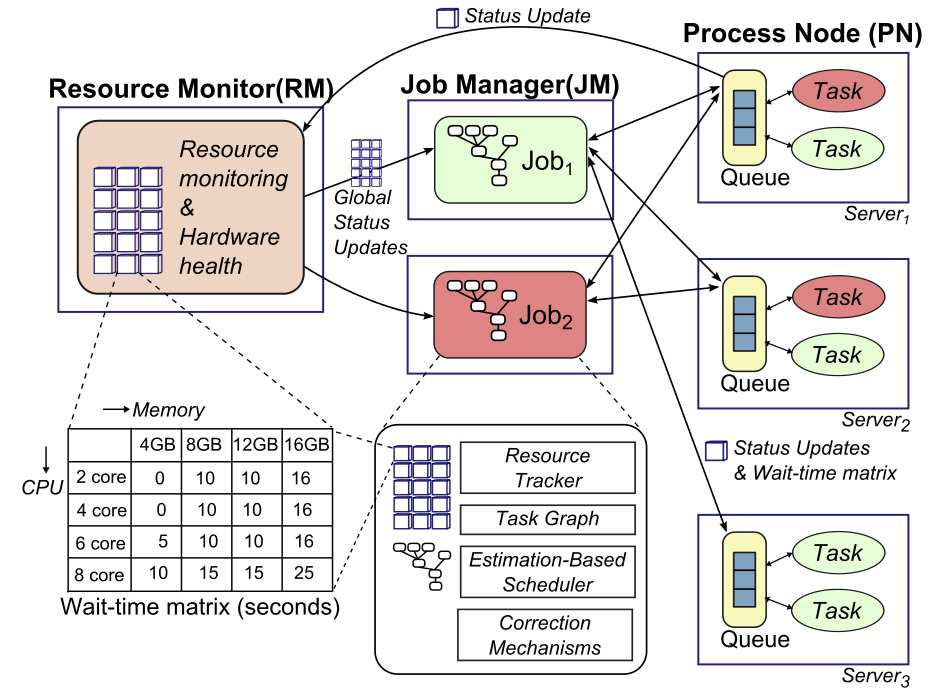
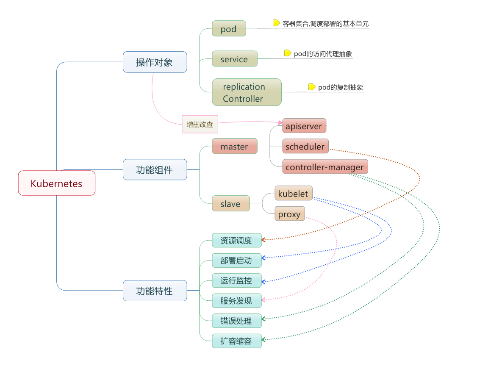

# Borg

## Characteristics：

1. 物理资源利用率高。
2. 服务器共享，在进程级别做隔离。
3. 应用高可用，故障恢复时间短。
4. 调度策略灵活。
5. 应用接入和使用方便。提供了完备的Job描述语言，服务发现，实时状态监控和诊断工具。

----
## Pros：
1. 隐藏资源管理和故障处理的细节，因此其用户可以专注于应用程序开发。
2. 提供高可靠性和高可用性操作，支持的应用也是如此。
3. 使我们能够有效地在数万台机器上运行工作负载。
## Cons：
1. 设计细节未公开。
2. 扩展性差：首先，集群规模受限，其次，新的调度策略难以融入现有代码中
3. 各个框架无法知道整个集群的实时资源使用情况。
4. 采用悲观锁，并发粒度小。

----
## Comment：
Borg是Google的第一代/第二代集群（资源）管理系统，负责权限控制、调度、启动、重新启动和监视全部的Google中运行的应用程序，功能完备强大。Borg不是解决这些问题的第一个系统，但它是在能够保证最大弹性和完整性情况下，以大规模运行的少数几个系统之一。后继Google已经做出了第三代集群管理系统Omega，较之Borg提高了扩展性，各框架可获得整个集群的实时资源使用情况使调度更优，并发粒度较大。

----
## Reference：
1. [Google Borg学习笔记](https://blog.csdn.net/zcc_heu/article/details/62040711)
2. [大规模集群管理系统Google Borg](https://blog.csdn.net/gdbreezyc/article/details/51801524)
3. [Google的大规模集群管理工具Borg------ Borg架构](https://blog.csdn.net/three_bird/article/details/51344543)

----
----
----

# Omega

## Characteristics

### 1.采用共享状态调度器（Shared-state scheduler）
共享状态调度器将双层调度器中的集中式资源调度模块简化为持久化的“共享数据”和针对这些数据的验证代码——这里的“共享数据”实际上就是整个集群的实时资源使用信息。可以理解为改进版的“双层调度器”。通过将双层调度器中的“共享数据”进行全局持久化，任何应用都可以看到集群资源信息。而且资源申请采用“乐观锁”（MVCC）优先级控制，大大提升并发性。

### 2.采用乐观并发策略
在Omega中，资源邀约是乐观的。每个应用程序可以请求群集上的所有可用资源，冲突在提交时解决。Omega的资源管理器基本上只是一个记录每个节点状态的关系数据库，使用不同类型的乐观并发控制解决冲突。这样的好处是大大增加了调度器的性能（完全并行）和更好的利用率。

----
## pros and cons
### pros
1. 调度策略十分灵活且强大，能够很好应对各种情况。
2. Omega非常容易使用。
3. 采用“乐观锁”，并发数极高

### cons
1. 服务性作业都较大，对（跨机架的）容错有更严格的配置需求。
2. 引入多版本并发控制后，限制该机制性能的一个因素是资源访问冲突，冲突次数越多，系统性能下降的越快。

----
## My comments
Omega，作为Borg的延伸，它的出现是出于提升Borg生态系统软件工程的愿望。Omega应用到了很多在Borg内已经被认证的成功的模式，但是是从头开始来搭建以期更为一致的构架。Omega存储了基于Paxos、围绕transaction的集群的状态，能够被集群的控制面板（比如调度器）接触到，使用了优化的进程控制来解决偶尔发生的冲突。这种分离允许Borgmaster的功能被区分成几个并列的组建，而不是把所有变化都放到一个单独的、巨石型的master里。许多Omega的创新（包括多个调度器）都被收录进了Borg.

----
## Reference：
1. [全方位对比Mesos、Omega和Borg](https://blog.csdn.net/lsjseu/article/details/49664275)
2. [解析Google集群资源管理系统Omega](http://dongxicheng.org/mapreduce-nextgen/google-omega/)
3. [Omega: flexible, scalable schedulers for large compute clusters](https://static.googleusercontent.com/media/research.google.com/zh-CN//pubs/archive/41684.pdf)
----
----
----

# Sigma

## Characteristics
1. Sigma是阿里巴巴建设的基于Pouch容器的在线资源调度系统，既能完成大规模计算需求，又能保证高并发脉冲计算的可靠性。
2. 实现混部架构，与基于进程的离线资源调度系统Fuxi（伏羲）深度集成，把两种调度并行处理，实现基础环境统一。
3. 突破了若干CPU、内存和网络资源隔离的关键技术。
4. 整体架构有Alikenel、SigmaSlave、SigmaMaster三层大脑联动合作，设计理念面向终态。

----
## Pros and Cons
### Pros
1. 三层大脑联动合作，能很好得处理单物理机日常调度、资源分配、应急处理，批量机器整体调度，决策优化等，系统整体的协调性和最终一致性非常好。
2. 将延迟不敏感的批量离线计算任务和延迟敏感的在线服务部署到同一批机器上运行，让在线服务用不完的资源充分被离线使用以提高机器的整体资源利用率。
3. 内存、CPU、网络资源实现有效隔离，保证各应用资源。
4. 实现不同的策略以适应双十一大促与日常场景需求。
5. 应用能做到自动收缩、垂直伸缩、分时复用。
6. Pouch容器开源，安全性高，是富容器，可以登录，兼容性好。

### Cons
1. 容器的调度过程存在一定的碎片化情况。
2. 富容器Pouch镜像较大，在大量建站时可能导致宿主机磁盘耗尽或耗时较长情况。
3. 最新架构系统仅经历过一次双十一，实际使用时间较短。

----
## My comment
阿里巴巴作为电子商务交易平台，体量做得很大，尤其是双十一大促销时的巨大流量，对阿里的服务器提出了更高的要求。Sigma集群与资源管理系统的建设与使用很好的解决了这一困境，提供了更好的服务的同时也节省了大量的资源。实现了混部架构将延迟不敏感的批量离线计算任务和延迟敏感的在线服务部署这两种需求资源不同的任务在同一机器上以提高了机器的资源利用率，同时也允许了弹性扩缩来处理脉冲情况。其将全阿里所有的计算资源全部集中在一起统筹管理，得以很好得处理日常计算需求与大促时的高脉冲需求。同时，阿里将系统所用的Pouch容器技术开源，系统也兼容了大量其他系统，促进行业共同健康发展。

----
## Reference
1. [阿里巴巴 Sigma 调度和集群管理系统架构详解](https://juejin.im/post/5ad867b06fb9a045fc665ca4)
2. [独家解密：阿里是如何应对超大规模集群资源管理挑战的？](https://yq.aliyun.com/articles/603311)
3. [如何提升集群资源利用率？ 阿里容器调度系统Sigma 深入解析](https://blog.csdn.net/alitech2017/article/details/80134042)

----
----
----

# Apollo

## Characteristics
1. 采用一种分布式 (*distributed*)和松散协调(*loosely coordinated*)的调度框架。每个调度器综合整个集群的资源利用信息独立地进行调度。
2. 将任务分配到能使其完成时间最短的服务器上。评估模型综合考虑数据的局部性、服务器负载和其他各种因素，让调度器根据这些因素进行加权决策。随着调度任务的执行，估计模型还可以通过观测到的类似任务的运行数据来对时间估计策略进行优化。
3. 引入轻量级的硬件独立机制来为调度器提供集群中所有服务器上的资源使用情况。每个调度器都拥有整个集群的信息，掌握了未来短期内每个服务器的可利用资源情况，在此基础上再进行调度决策。
4. 采用了一系列的校正机制，在运行时动态地调整和优化非最优的调度决策，提出了一种独有的延时修正机制来解决不同调度器之间的决策冲突。
5. 引入了机会调度策略。Apollo将作业分成了两类，常规作业(*regular tasks*)和机会作业(*opportunistic tasks*)，并使用基于token的机制来管理容量并通过限制常规任务的总数来避免集群的负载过高。
6. 支持分阶段部署到生产环境和逐步验证。

----
## Architecture

上图是Apollo的整体架构图。

Job Manager（JM）是一个调度器，负责对作业进行调度。每个集群都会拥有一个Resource Monitor（RM），每台服务器都拥有一个Process Node（PN），它们协调工作来为调度器提供整个集群的负载信息，供调度器进行调度决策时使用。每个PN负责对本地服务器的资源进行管理，RM会持续地从集群中每个服务器上的PN那里收集信息，汇总成全局信息后给每个JM。

----
## Pros and Cons
### Pros
1. 很好地平衡了可扩展性和调度质量，既消除了传统中心式框架的可扩展性瓶颈和单点故障问题，又避免了完全去中心化架构造成的独立调度器之间产生的冲突。
2. 独立的调度器拥有整个集群的负载信息并进行作业完成时间估计，使得任务完成时间最小化，保证了相当高的调度质量。
3. 通过动态调整能够及时处理无法预测的集群变化、不准确的任务运行时间估计以及其它异常运行行为，整个框架十分健壮。
4. 通过机会调度达到了很高的集群资源利用率。
5. 支持分阶段部署和验证保障了使用Apollo替换原有框架时业务的正常运行。

### Cons
1. Apollo使用了低优先级后台任务随机执行的策略来增加集群资源利用率，可能会导致这些任务有较长的延迟。
2. Apollo在估计任务等待时间时没有利用重现任务（recurring jobs)的统计数据,也没有很好地理解任务的间隔，这也是之后改进工作中的一部分。

----
## My comment
Apollo是一个高度可扩展协作的集群调度框架，通过分布式架构保证了可扩展性，同时通过集群状态共享保证了调度的质量。目前，Apollo已被部署在Microsoft的实际生产环境之中，每天负责上万台服务器上数以十亿计的高并发任务的调度和管理，在实际应用中取得了良好的效果，是一个优秀的集群调度框架。

----
## Reference
 1. [Apollo：Scalable and Coordinated Scheduling for Cloud-Scale Computing](https://www.usenix.org/system/files/conference/osdi14/osdi14-paper-boutin_0.pdf)
 2. [每周论文·Apollo: Scalable and Coordinated Scheduling for Cloud-Scale Computing](https://blog.csdn.net/violet_echo_0908/article/details/78174782)
 3. [Large-scale cluster management at Google with Borg](https://static.googleusercontent.com/media/research.google.com/zh-CN//pubs/archive/43438.pdf)
 
 ----
 ----
 ----
 
 # Kubernetes
## Characteristics
1. 它是容器集群管理系统，是一个开源的平台，可以实现容器集群的自动化部署、自动扩缩容、维护等功能。
2. 通过Kubernetes，你可以快速部署应用，快速扩展应用，无缝对接新的应用功能，节省资源，优化硬件资源的使用，可以促进完善组件和工具的生态系统，以减轻应用程序在公有云或私有云中运行的负担。
3. 可移植：支持公有云，私有云，混合云，多重云（multi-cloud）
4. 可扩展：模块化，插件化，可挂载，可组合
5. 自动化：自动部署，自动重启，自动复制，自动伸缩扩展

--------
## Architecture

以上为Kubernetes的架构图。

1. 节点:一个节点是一个运行Kubernetes中的主机。
2.  容器组：一个Pod对应于由若干容器组成的一个容器组，同个组内的容器共享一个存储卷(volume)。
3.  容器组生命周期：包含所有容器状态集合，包括容器组状态类型，容器组生命周期，事件，重启策略，以及replication controllers.
4.  Replication Controllers：主要负责指定数量的pod在同一时间一起运行。
5.  服务：一个Kubernetes服务是容器组逻辑的高级抽象，同时也对外提供访问容器组的策略。
6.  卷：一个卷就是一个目录，容器对其有访问权限。
7. 标签：标签是用来连接一组对象的，比如容器组。标签可以被用来组织和选择子对象。
8. 接口权限：端口，ip地址和代理的防火墙规则。
9. web界面：用户可以通过web界面操作Kubernetes。
10. 命令行操作：kubecfg命令。

----------
## Pros and cons
### pros
 1. 快速创建/部署应用：与VM虚拟机相比，容器镜像的创建更加容易。
 2. 持续开发、集成和部署：提供可靠且频繁的容器镜像构建/部署，并使用快速和简单的回滚(由于镜像不可变性)。
 3. 开发和运行相分离：在build或者release阶段创建容器镜像，使得应用和基础设施解耦。
 4. 开发，测试和生产环境一致性：在本地或外网（生产环境）运行的一致性。
 5. 云平台或其他操作系统：可以在 Ubuntu、RHEL、 CoreOS、on-prem、Google Container Engine或其它任何环境中运行。
 6. Looselycoupled，分布式，弹性，微服务化：应用程序分为更小的、独立的部件，可以动态部署和管理。
 7. 资源隔离
 8. 资源利用：更高效
 
### cons
1. 由于container本身相较于VM是一个轻量级的实现，尽管从逻辑上我们有namespace、label、pod、container几层的隔离，但事实上包括container本身都是一个基于逻辑意义上的隔离，并没有一个基于软件调用层面的stack划分。更薄的层级关系让性能损耗降到较低。
2. 由于没有严格的stack划分，资源隔离直接受制于cgroup，用户态隔离则直接受制于kernel中的namespace，不具有严格意义上的逐级隔离。
3. Kubernetes的技术仍然处在早期阶段，还不够成熟，还无法进行规模化的部署来帮助他们的客户提取出容器技术的商业价值

----
## My comment
Kubernetes自2014年推出以来，一直保持稳步增长，这要归功于云原生应用的兴起，它的意义在于让云成为云化战略成功的基石，而不是阻碍。在Kubernetes集群中，不同的环境可以通过namespace进行隔离，保证彼此不互相干扰。在Kubernetes集群中，不同的环境可以通过namespace进行隔离，保证彼此不互相干扰。可以说，Kubernetes在像 OpenStack 这样的基础架构即服务（IaaS）和完整的平台即服务（PaaS）的资源之间达到了最佳平衡，它的底层运行时实现完全由供应商控制。

----
## Reference
1. [kubernetes初探](https://blog.csdn.net/zhongqi0808/article/details/52526710)
2. [kubernetes中文社区](http://docs.kubernetes.org.cn/227.html)
3. [Kubernetes为什么会逐渐成为云计算的标准？](https://baijiahao.baidu.com/s?id=1589733376057191100&wfr=spider&for=pc)
