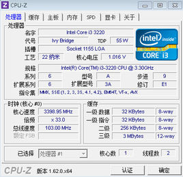
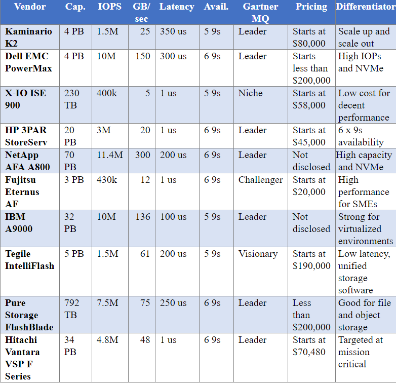

# **Technical Report about CPU、Memory、Storage、Network and xPU**

# CPU
# vendors: Intel & AMD
### &#8195;&#8195;两家公司的成立仅相隔一年，英特尔是名副其实的技术流派，掌握着芯片研发的最高话语权，而AMD则作为以销售主导的公司。
### &#8195;&#8195;在2016年以前，只有1999~2000年AMD发布K7K8架构时在市场份额上击败了Intel，其余时间一直是Intel占据了市场的绝大部分份额。
### &#8195;&#8195;在2017年2月21日，AMD推出了AMD Ryzen7处理器，采用14nm制程工艺，8核16线程设计，L2/L3 总缓存 20MB。在制程工艺和多核技术上领先Intel，市场份额有所提高。
# types
### 1. 台式机CPU
### 2. 服务器CPU
### 3. 移动版CPU

## featuresadadas
### 1. 台式机CPU较为均衡。
### 2. 服务器CPU追求性能。
### 3. 移动版CPU 追求低发热量和低功耗。
## Pros&Cons
### 移动版CPU耗能低但同时运算能力较差；台式机CPU较为均衡，既追求性能也追求低能耗；服务器CPU通常耗能较高，但性能较强。
# technologies
### CPU制程的先进与否决定了CPU的性能优劣。目前主流CPU制程达到12~32nm，更小的制程代表CPU可以集成更多的晶体管，使其具有更高的性能，同时工作电压减小，工作发热能耗减少。
---
# key indicators
# what
1. 主频
2. 超线程
3. 缓存
4. 核心电压
5. 总线速度
6. 流水线工艺
7. 制程尺寸
8. 指令集
# how to measure

### CPU的所有参数可以使用CPU-Z软件查看。
---
# Comment
### CPU在经过了几十年的发展后已经相当强大，目前市场发行的CPU已经达到了12nm制程工艺，可以预见将来还会发行制程工艺更先进的CPU。除去单核性能的不断增强，目前CPU的发展趋势越来越注重多核的发展和应用，相应的，这也需要软件对多线程的合理使用和支持，否则多核多线程的优势难以发挥。

# Memory
## vendors:
 1. 力晶，中国台湾内存颗粒生产厂商，其简称为PSC，标志明显。与南亚、茂矽并称台湾内存制造业三巨头。
 2. 尔必达elpida是日本内存颗粒生产厂商，但已宣告破产。
 3. 海力士与前生的现代颗粒合二为一，hynix标志为现代，S K hynix标志为现在的海力士。
 4. 华邦也是台湾著名的内存芯片生产商，内存芯片标志为Winbond。
 5. 茂德在DDR3时代已经开始走下坡路，标识为一个LOGO图标。
 6. 镁光是美国的代表内存品牌，一个“M”加一个圈就是镁光内存最好的标识。
 7. 南亚是我国台湾生产的内存颗粒，“Nanya”英文是南亚最大的标志，也是最有潜力的一家内存颗粒生产厂商，自家内存条品牌为南亚易胜。
 8. 奇梦达是英飞凌科技公司旗下，总部位于德国慕尼黑，德国最大的半导体产品制造商。事后我国的浪潮集团收购。
 9. 韩国的三星内存颗粒可能当下最多产能的，标识也比较明显分为两种。一种是直接带有samsung标志，另外一种则是sec英文开头。

## types:
1. SRAM
 SRAM（Static RAM）意为静态随机存储器。SRAM数据不需要通过不断地刷新来保存，因此速度比DRAM（动态随机存储器）快得多。但是SRAM具有的缺点是：同容量相比DRAM需要非常多的晶体管，发热量也非常大。因此SRAM难以成为大容量的主存储器，通常只用在CPU、GPU中作为缓存，容量也只有几十K至几十M。
2. RDRAM
RDRAM是由RAMBUS公司推出的内存。RDRAM内存条为16bit，但是相比同期的SDRAM具有更高的运行频率，性能非常强。然而它是一个非开放的技术，内存厂商需要向RAMBUS公司支付授权费。并且RAMBUS内存的另一大问题是不允许空通道的存在，必须成对使用，空闲的插槽必须使用终结器。
3. XDR RAM
XDR内存是RDRAM的升级版。依旧由RAMBUS公司推出。XDR就是“eXtreme Data Rate”的缩写。XDR依旧存在RDRAM不能大面普及的那些不足之处。
4. Fe-RAM
铁电存储器是一种在断电时不会丢失内容的非易失存储器，具有高速、高密度、低功耗和抗辐射等优点。由于数据是通过铁元素的磁性进行存储，因此，铁电存储器无需不断刷新数据。其运行速度将会非常乐观。而且它相比SRAM需要更少的晶体管。它被业界认为是SDRAM的最有可能的替代者。
5. MRAM
磁性存储器。它和Fe-RAM具有相似性，依旧基于磁性物质来记录数据。
6. OUM
相变存储器。奥弗辛斯基（Stanford Ovshinsky）在1968年发表了第一篇关于非晶体相变的论文，创立了非晶体半导体学。一年以后，他首次描述了基于相变理论的存储器：材料由非晶体状态变成晶体，再变回非晶体的过程中，其非晶体和晶体状态呈现不同的反光特性和电阻特性，因此可以利用非晶态和晶态分别代表“0”和“1”来存储数据。

## key indicators
1. 系统时钟循环周期---他表示了SDRAM能运行的最大频率。譬如：一块系统时钟频率为10ns的SDRAM的芯片，他可以运行在100MHz的频率下。绝大多数的SDRAM芯片能达到这个要求。显然，这个数字越小，SDRAM芯片所能运行的频率就越高。对于现代（Hyundai）PC-100 SDRAM，它的芯片上所刻的-10代表了其运行的时钟周期为10ns，他可以跑100MHz的外频。根据现代的产品数据表我们可以知道这种芯片的存取数据的时间（以下会讲到该指标）为6ns。
2. 存取时间---类似于EDO/FPM DRAM，他代表了读取数据所延迟的时间。绝大多数SDRAM芯片的存取时间为6，7，8或10ns。可是千万不要和系统时钟频率所混淆。许多人都把存取时间当作这块SDRAM芯片所能跑的外频。对于高士达（Goldstar）PC-100 SDRAM，它的芯片上所刻的-7代表了其存取时间为7ns。然而他的系统时钟频率仍然为10ns，外频为100MHz。
3. CAS(纵向地址脉冲)反应时间---CAS的延迟时间。某些SDRAM能够运行在CAS Latency(CL)2或3模式。也就是说他们读取数据所延迟的时间既可以是二个时钟周期也可以是三个时钟周期。我们可以把这个性能写入SDRAM的EEPROM中，这样PC的BIOS会检查此项内容，并且以CL=2模式这一较快的速度运行。

## my comment(example of tradeoff)
  市场上常见的SDRAM品牌有现代、三星、LG、NEC、东芝、西门子、TI(德州仪器)等等。购买时应注意观察芯片表面印字是否清晰，标称速度为多少以及产地。需要特别说明的是上面所说的品牌仅仅是指内存芯片，而不是整个内存条，将内存芯片封装在电路板上制成内存条的工作是由其他厂商完成的。例如著名的美国金仕顿内存只是封装其他厂商的优质内存芯片制成的，它本身并不生产内存芯片。所以，即使采用同一品牌芯片的内存条，由于封装厂商不一，质量也会存在很大差异，这可以从电路板的工艺上看出。好的电路板，外观看上去颜色均匀、表面光滑、边缘整齐无毛边，采用六层板结构且手感较重。主流的LGS内存已经被HY内存取代，虽然牌子换了，但是东西还是一样的，常见的型号是GM72V66841ET7J，是8×8的颗粒。记得买的内存颗粒型号是GM72V66841CT7J，和的内存一样。市场上的PC-133条子的CAS参数基本上都是3，想买真正CAS参数为2的PC133内存条还要等一段时间。KINGMAX内存和樵风）的金条也是不错的选择，是那种内存都采用专利的封装技术，所以不会碰到假货。

---
# Storage
## vendors
* **Data Center Storage Companies**：数据存储市场领导者,是寻求部署存储区域网络（SAN）或网络附加存储（NAS）技术以及越来越多的混合云存储解决方案的企业的首选公司  
1. Dell EMC
2. HPE
3. NetApp
4. IBM
5. Hitachi Vantara
6. Huawei
* **Data Storage Companies**: 精英企业，这些企业为企业客户提供了自己的存储解决方案
1. Oracle
2. Lenovo
3. Fujitsu
4. Western Digital
* **All-Flash Upstart Storage Companies**：专注于支持全闪存的阵列储存,有助于设定新的应用程序和数据库性能标准
1. Pure Storage
2. Violin Systems
3. Tegile
4. Kaminario
* **Hyperconverged Storage Companies**: 超融合存储基础架构将存储，计算和网络结合到高度虚拟化系统,采用软件定义的横向扩展方法来实现系统和工作负载管理，为企业如何运行和管理存储工作负载提供了极大的灵活性
1. Nutanix
2. Pivot 3
3. HPE SimpliVity

## types and technologies
* 根据储存服务在客户端访问接口的不同，可分为以下三类
1. **File Storage**：为多个客户端提供访问单个共享文件夹的能力  
组织方式：数据文件被组织为结构化命名目录   
适合用例：档案共享、大数据、影音文件等
2. **Block Storage**：提供对等效原始块设备的网络访问  
组织方式：数据通常以固定大小的块存储在设备上  
适合用例：频繁变化内容、随机读写、突发I / O
3. **Object Storage**：通过REST API调用提交对象，并返回标识符  
组织方式：对象数据具有URL或ObjectID的句柄  
适用用例：云储存、无服务器容器存储、分析和物联网、机器（深度）学习

* 根据储存介质的不同，基本可分为以下几类
1. **磁存储HDD**：在一些磁性介质上以正和负磁极的模式编码数据，具有机械部件  
容量：存储容量范围从MB到数百TB  
优点：廉价、可靠  
缺点：碰撞易损坏  
2. **光存储**：使用激光/光学反射现象来读取或写入数据  
容量：CD-数百MB  DVD-可达几十GB  
优点：每盘低成本  
缺点：寿命相对较短,不可靠   
3. **固态存储SSD**：使用非易失性存储器,仅依靠半导体和电子设备进行数据存储  
容量：数十GB到TB  
优点：更快的I/O性能,更坚固可靠,更少的功率  
缺点：相对昂贵,存储空间相对HDD较小  

## Key indicatiors
* 对于企业级客户来说储存服务的关键指标在于**储存容量、适合内容、读写速率、延迟、价格**等方面，可以从以下图片看到顶尖全闪存储存供应商的指标比较：  

* 对于单一储存盘来说,其关键指标有**硬盘容量、硬盘速度、接口类型、缓存、IOPS、带宽、响应时间、价格等**，其中  
1. IOPS：I/O per second，即每秒钟可以处理的I/O个数，用来衡量存储系统的I/O处理能力
2. 带宽：每秒钟可以处理的数据量，用于衡量存储系统的吞吐量，常以KB/S或MB/s或GB/s为单位
3. 响应时间：发起I/O请求到I/O处理完成的时间间隔，常以毫秒（ms）为单位   
>以上指标可以用如dd、fio、IOMeter、AS SSD、CrystalDiskInfo等测试工具测试获取,而价格等方面可以查询官方销售店铺

## My Comment
1. CEPH：描述了一个高性能、高可靠、可扩展分布式文件系统，其主要组件有Client、OSD集群、MDS，其中Client暴露POSIX接口，OSD集群集中智能储存数据和元素据，MDS集中管理处理命名空间元数据操作。通过使用专为异构和动态集群系统设计的伪随机数据分布函数（CRUSH）替代分配表来计算任何对象的分发和储存位置，避免了负载不均衡不对称的问题，不依赖块或对象元数据列表。通过使用Dynamic Subtree Partitioning提供负载分布的加权树,定期比较动态迁移以在保有局部性的同时促进积极预取以有效利用MDS资源提高性能。CEPH提出并实现的新技术以提高分布式系统的可扩展性、吞吐量、性能、可靠性为目标，提供高效的元数据管理，并有效提高系统在数据储存、复制及删除、故障检测及恢复的能力。  
CEPH的作者以此为基础创立了Inktank公司，旨在为开源Ceph存储系统提供专业服务和支持，使Ceph成为一个基础广泛的协作开源项目与充满活力的用户，开发人员和商业社区。公司创立后备受好评，被列入2012年CRN 10热门新兴供应商，并在2014年被Red Hat高价收购。可见Ceph所描述的文件系统是有很高价值与活力的，并在为世界提供更好的更优质的存储服务的路上不断努力。
2. 世界正走在不断互联的路上，由此产生了大量的数据，物联网、大数据、数据挖掘等名词不断出现并变得火热，有人在不断产生数据，有人在不断利用数据，而这一切都需要以拥有一个强大的数据存储系统为前提，越来越大量的数据保存与读取都在对存储系统提出更高的要求，想要更快的速度，更高的并发，更好的安全。无论是要怎样利用数据，都需要先选择使用怎么的存储系统，选择的根本要根据需求来定，需要存储怎样的数据，是文本还是视频，是结构化的还是非结构化的，需要怎样的访问负载，需要怎样的容量要求，需要怎样的安全要求，以此来做出权衡，选取合适的存储系统。

## reference
* [Sage A. Weil, Scott A. Brandt, Ethan L. Miller, Darrell D. E. Long. Ceph: A Scalable, High-Performance Distributed File System. OSDI, 2006](https://www.ssrc.ucsc.edu/Papers/weil-osdi06.pdf)
* [20 Top Enterprise Data Storage Vendors](http://www.enterprisestorageforum.com/products/20-top-enterprise-data-storage-vendors.html)
* [What are the different types of storage: block, object and file?](https://blog.ubuntu.com/2015/05/18/what-are-the-different-types-of-storage-block-object-and-file)
* [SNIA-Block-File-Object-Storage-Webcast-Final](https://www.snia.org/sites/default/files/ESF/SNIA-Block-File-Object-Storage-Webcast-Final.pdf)
* [Storage Technologies and their Devices](https://medium.com/computing-technology-with-it-fundamentals/storage-technologies-and-their-devices-1594293868f0)
* [Types of Storage](http://typesofbackup.com/types-of-storage/)
* [Best Flash Storage: Top 10 All-Flash Storage Array Vendors](http://www.enterprisestorageforum.com/products/best-flash-storage-all-flash-storage-array-vendors.html)
* [几种硬盘IO性能测试工具](https://cn.aliyun.com/jiaocheng/154982.html)
* [性能指标之资源指标-磁盘](https://blog.csdn.net/lin443514407lin/article/details/55102167)
* [Inktank Storage](https://en.wikipedia.org/wiki/Inktank_Storage)
* [Red Hat to acquire Inktank](https://ceph.com/geen-categorie/red-hat-to-acquire-inktank/)
* [Red Hat Ceph Storage](https://www.redhat.com/en/technologies/storage/ceph)

---
# Network
## vendors
* **中国大陆三大运营商**：  
1. 中国电信：拨号上网、ADSL、1X、CDMA1X,EVDO rev.A、FTTx、光纤接入EPON、FDD/TDD LTE
2. 中国移动：拨号上网、GPRS及EDGE无线上网、TD-SCDMA无线上网，一少部分FTTx、FDD LT
3. 中国联通：GPRS,W-CDMA、无线上网、 拨号上网、ADSL、FTTx、FDD/TDD LTE

* **香港**
1.  Cyber Express
2. 和记环球电讯
3. NWTbb

* **台湾**
1. WiMAX行动宽带上网
2. 远传电信 (远东集团子公司)
3. 大同电信 WiMAX Our Life

* **新加坡：**
1. 星和MaxOnline：提供宽带和无线宽带上网
2. 新电信：提供拨号上网、ADSL和无线上网
3. Pacific Internet：宽带

* **美国**
1. 美国在线
2. 美国的ISP-美国在线AOL

## types and technologies
* 网络类型的划分标准各种各样，但是从地理范围划分是一种大家都认可的通用网络划分标准，可分为以下四类
1. **局域网（local area network LAN）**  
通常我们常见的“LAN”就是指局域网，这是我们最常见、应用最广的一种网络。几乎每个单位都有自己的局域网，有的甚至家庭中都有自己的小型局域网。很明显，所谓局域网，那就是在局部地区范围内的网络，它所覆盖的地区范围较小。局域网在计算机数量配置上没有太多的限制，少的可以只有两台，多的可达几百台。  
Pros：配置容易，连接速率高  
Cons：连接范围窄，用户数少

2. **城域网（metropolitan area network MAN）**  
这种网络一般来说是在一个城市，但不在同一地理小区范围内的计算机互联。这种网络的连接距离可以在10￣100公里，它采用的是IEEE802.6标准。MAN与LAN相比扩展的距离更长，连接的计算机数量更多，在地理范围上可以说是LAN网络的延伸。  
Pros：范围相比局域网变大，连接用户数量更多  
Cons：速率降低

3. **广域网：（wide area network WAN）**  
这种网络也称为远程网，所覆盖的范围比城域网（MAN）更广，它一般是在不同城市之间的LAN或者MAN网络互联，地理范围可从几百公里到几千公里。  
Pros：范围大、用户多  
Cons：信息衰减比较严重

4. **无线网**  
是采用无线通信技术实现的网络，分为通过公众移动通信网实现的无线网络（如4G，3G或GPRS）和无线局域网（WiFi）两种方式。  
Pros：易于安装和使用  
Cons：数据传输率一般比较低，远低于有线局域网；另外无线局域网的误码率也比较高，而且站点之间相互干扰比较厉害。

## Key indicators  
* **计算机性能指标**
1. 速率：连接在计算机网络上的主机在数字信道上传送数据的速率，它也称为数据率（data rate）或比特率（bit rate）。
2. 带宽：在计算机网络中，带宽用来表示网络的通信线路所能传送数据的能力，因此网络带宽表示在单位时间内从网络中的某一点到另一点所能通过的“最高数据率”。单位是“比特每秒”，记为bit/s。
3. 吞吐量；在单位时间内通过某个网络（或信道、接口）的数据量。吞吐量更经常地用于对现实世界中的网络的一种测量，以便知道实际上到底有多少数据量能够通过网络。
4. 时延：数据（一个报文或分组，甚至比特）从网络（或链路）的一端传送到另一端所需的时间。
5. 时延带宽积：把以上讨论的网络性能的两个度量—传播时延和带宽相乘，就得到另一个很有用的度量：传播时延带宽积，即时延带宽积=传播时延×带宽。
6. 往返时间：从发送方发送数据开始，到发送方收到来自接收方的确认（接受方收到数据后便立即发送确认）总共经历的时间。
7. 利用率：利用率有信道利用率和网络利用率两种。信道利用率指某信道有百分之几的时间是被利用的（有数据通过），完全空闲的信道的利用率是零。网络利用率是全网络的信道利用率的加权平均值。  

* **计算机非性能指标**
1. 费用：网络的价格（包括设计和实现的费用）。网络的性能与其价格密切相关。一般说来，网络的速率越高，其价格也越高。
2. 质量：网络的质量取决于网络中所有构件的质量，以及这些构件是怎样组成网络的。网络的质量影响到很多方面，如网络的可靠性、网络管理的简易性，以及网络的一些性能。
3. 标准化：网络的硬件和软件的设计既可以按照通用的国际标准，也可以遵循特定的专用网络标准。最好采用国际标准的设计，这样可以得到更好的互操作性，更易于升级换代和维修，也更容易得到技术上的支持。
4. 可靠性：可靠性与网络的质量和性能都有密切关系。速率更高的网络，其可靠性不一定会更差。但速率更高的网络要可靠地运行，则往往更加困难，同时所需的费用也会较高。
5. 可拓展性和可升级性：网络在构造时就应当考虑到今后可能会需要扩展（即规模扩大）和升级（即性能和版本的提高）。网络的性能越高，其扩展费用往往也越高，难度也会相应增加。
6. 易于管理和维护：网络如果没有良好的管理和维护，就很难达到和保持所设计的性能。

## My comment
计算机和计算机网络是21世纪人类的伟大创造，没有哪个发明像计算机和计算机网络这样对整个人类文明和社会进步发生了和发生着如此巨大、如此深刻的影响。是实现计算机之间互相通信的一系列设备，由于网络的诞生使得计算机能够实现资源的共享，网络是一次信息革命的标志。和所有新技术一样，还有很多局限性，有很多发展空间，目前网络已经深入到每个家庭，随着应用需求日益增大，网络必将是发展得最快的技术之一。

## Reference
* [网络业务提供商-百度百科](https://baike.baidu.com/item/%E7%BD%91%E7%BB%9C%E4%B8%9A%E5%8A%A1%E6%8F%90%E4%BE%9B%E5%95%86/5938989?fr=aladdin&fromid=16615457&fromtitle=%E7%BD%91%E7%BB%9C%E6%8F%90%E4%BE%9B%E5%95%86)
* [计算机网络（连接分散计算机设备以实现信息传递的系统）-百度百科](https://baike.baidu.com/item/%E8%AE%A1%E7%AE%97%E6%9C%BA%E7%BD%91%E7%BB%9C/18763?fr=aladdin)
* [计算机网络性能评估-百度百科](https://baike.baidu.com/item/%E8%AE%A1%E7%AE%97%E6%9C%BA%E7%BD%91%E7%BB%9C%E6%80%A7%E8%83%BD%E8%AF%84%E4%BC%B0/21871310)
* [无线网络-百度百科](https://baike.baidu.com/item/%E6%97%A0%E7%BA%BF%E7%BD%91%E7%BB%9C/169080?fr=aladdin)
* [计算机几种网络类型及其特征](https://zhidao.baidu.com/question/426323215973036492.html)