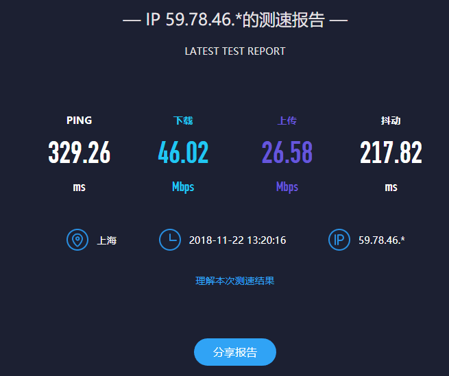

# 磁盘性能测试 
## 概念
1.  磁盘性能指标：--IOPS  
    IOPS (Input/Output Per Second)即每秒的输入输出量(或读写次数)，是衡量磁盘性能的主要指标之一。IOPS是指单位时间内系统能处理的I/O请求数量，一般以每秒处理的I/O请求数量为单位，I/O请求通常为读或写数据操作请求。  
    * 随机读写频繁的应用，如小文件存储(图片)、OLTP数据库、邮件服务器，关注随机读写性能，IOPS是关键衡量指标。 
    * 顺序读写频繁的应用，传输大量连续数据，如电视台的视频编辑，视频点播VOD(Video On Demand)，关注连续读写性能。数据吞吐量是关键衡量指标。
    * 寻道时间 Tseek是指将读写磁头移动至正确的磁道上所需要的时间。寻道时间越短，I/O操作越快，目前磁盘的平均寻道时间一般在3－15ms  
    * 旋转延迟 Trotation是指盘片旋转将请求数据所在扇区移至读写磁头下方所需要的时间。旋转延迟取决于磁盘转速，通常使用磁盘旋转一周所需时间的1/2表示。比如，7200 rpm的磁盘平均旋转延迟大约为60*1000/7200/2 = 4.17ms，而转速为15000 rpm的磁盘其平均旋转延迟为2ms。
    * 数据传输时间 Ttransfer是指完成传输所请求的数据所需要的时间，它取决于数据传输率，其值等于数据大小除以数据传输率。目前IDE/ATA能达到133MB/s，SATA II可达到300MB/s的接口数据传输率，数据传输时间通常远小于前两部分消耗时间。简单计算时可忽略。  
2.  最大IOPS的理论计算方法  
IOPS = 1000 ms/ (寻道时间 + 旋转延迟)。可以忽略数据传输时间。
3. 影响测试的因素  
实际测量中，IOPS数值会受到很多因素的影响，包括I/O负载特征(读写比例，顺序和随机，工作线程数，队列深度，数据记录大小)、系统配置、操作系统、磁盘驱动等等。因此对比测量磁盘IOPS时，必须在同样的测试基准下进行，即便如此也会产生一定的随机不确定性。

## 测试
### 测试工具： CrystalDiskMark
### 测试对象：SAMSUNGMZVLB512HAJQ-000L2 (512 gB)
* CrystalDiskMark  
      
由上图可知,测试数据大小为1G， 次数为5
* queues = 32， thread = 1时：
    * sequential read: 2492.2MB/s, write: 1885.7MB/s
    * random read 4KB: 295.4MB/s, IOPS = 72125.0, write 4KB: 104.243MB/s, IOPS = 25450.0
* queues = 8, thread = 8时：
    * random read 4KB: 994.9 MB/s IOPS = 242895.8, write 4KB: 620.8MB/s IOPS = 151568.6
* queues = 1, thread = 1时：
    * random read 4KB: 34.61MB/s, IOPS = 8449.O, write 4KB: 59.91MB/s, IOPS = 14626.5  

由此可见，作为SSD硬盘关键指标的随机读写性能, 其单位是以万来记，最高时可达二十多万，相比传统机械硬盘不足300的IOPS，性能可谓十分强大。并且queue和thread都较多时才性能才高。

# 网络性能测试
## 概念
1. 网络带宽  
    网络带宽是指在单位时间（一般指的是1秒钟）内能传输的数据量。网络和高速公路类似，带宽越大，就类似高速公路的车道越多，其通行能力越强。单位 bit/s
2. 吞吐量  
    吞吐量是指在规定时间、空间及数据在网络中所走的路径（网络路径）的前提下，下载文件时实际获得的带宽值。由于多方面的原因，实际上吞吐量往往比传输介质所标称的最大带宽小得多。
3. 影响因素  
    * 网络设备（交换机、路由器、集线器）
    * 拓扑结构（即网络构造形状，如星型、环状)
    * 数据类型
    * 客户机与服务器
    * 电力系统和自然灾害引起的故障率。

## 测试
### 测试工具：SPEEDTEST
### 测速点：1.网成云上海测速点 2.成都云测节点-CN 3.上海云测节点-CN
本机带宽：  100Mbps  

1. 上海  

 2. 成都  
  
上两图发现虽然上海的测试点距离较近，但是连接并不稳定，延迟较高切抖动较大，但是下载和上传因为距离近所以还是比较快的，成都测试点虽然连接更稳定，但是距离远导致传输速率低。猜想是因为网成云的服务器比较差，所以连接不稳定。之后改用同为云测节点-CN的上海测速点来测：  
  
发现延迟明显下降，且下载和上传速度都更高，抖动也明显降低，符合上诉猜想。  
并且发现越近、越稳定，实际带宽也越高，但是最高不会超过主机带宽的100%。
