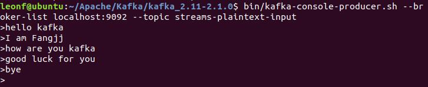
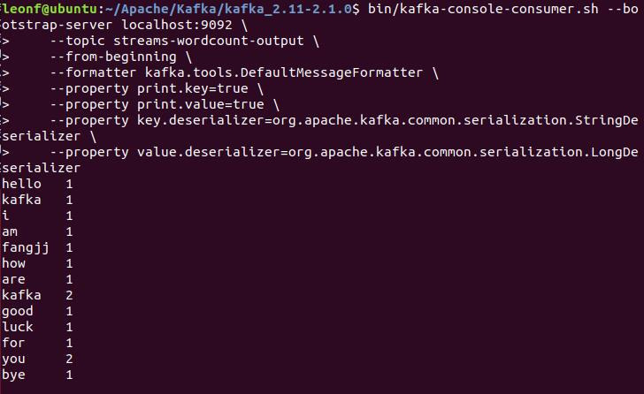

# A scenario to demonstrate the streaming processing
## scenario
* **WordCount** project is a demo project from kafka
* In this demo, kafka stream application run with the server, use "stateful" computations to the topology by counting the occurrence of the words split from the source text stream. 
* The application will compute the number of occurrences of the word prodeced from **prodecer** and then pass to the **consumer** who will show the number
* WordCount main code
```
builder.<String, String>stream("streams-plaintext-input")
               .flatMapValues(value -> Arrays.asList(value.toLowerCase(Locale.getDefault()).split("\\W+")))
               .groupBy((key, value) -> value)
               .count(Materialized.<String, Long, KeyValueStore<Bytes, byte[]>>as("counts-store"))
               .toStream()
               .to("streams-wordcount-output", Produced.with(Serdes.String(), Serdes.Long()));
```

## process step
* 建立项目
1. 首先需要用**maven**在某目录下创建创建项目并导入文件
2. 使用 **mvn clean package** 编译通过备用
* 在kafka解压文件夹下运行kafka
1. 新建终端开启**ZooKeeper**
```
bin/zookeeper-server-start.sh config/zookeeper.properties
```
2. 新建终端开启**kafka server**
```
bin/kafka-server-start.sh config/server.properties
```
3. 创建**input topic**
```
bin/kafka-topics.sh --create \
    --zookeeper localhost:2181 \
    --replication-factor 1 \
    --partitions 1 \
    --topic streams-plaintext-input
```
4. 创建**output topic**
```
bin/kafka-topics.sh --create \
    --zookeeper localhost:2181 \
    --replication-factor 1 \
    --partitions 1 \
    --topic streams-wordcount-output \
    --config cleanup.policy=compact
```
5. 开启WordCount演示应用
* 从apache官方库运行WordCount
```
bin/kafka-run-class.sh org.apache.kafka.streams.examples.wordcount.WordCountDemo
```
* 在建立项目的目录运行应用（运行自己的项目时使用）
```
mvn exec:java -Dexec.mainClass=myapps.WordCount
```
6. 新建终端开启**producer**接受输入
```
bin/kafka-console-producer.sh \
    --broker-list localhost:9092 \
    --topic streams-plaintext-input
```
7. 新建终端开启**consumer**输出结果
```
bin/kafka-console-consumer.sh --bootstrap-server localhost:9092 \
    --topic streams-wordcount-output \
    --from-beginning \
    --formatter kafka.tools.DefaultMessageFormatter \
    --property print.key=true \
    --property print.value=true \
    --property key.deserializer=org.apache.kafka.common.serialization.StringDeserializer \
    --property value.deserializer=org.apache.kafka.common.serialization.LongDeserializer
```
## Test Result
1. 输入流  

2. 输出流  


## Reference
1. [Run Kafka Streams Demo Application](http://kafka.apache.org/21/documentation/streams/quickstart)
2. [Tutorial: Write a Kafka Streams Application](http://kafka.apache.org/21/documentation/streams/tutorial)