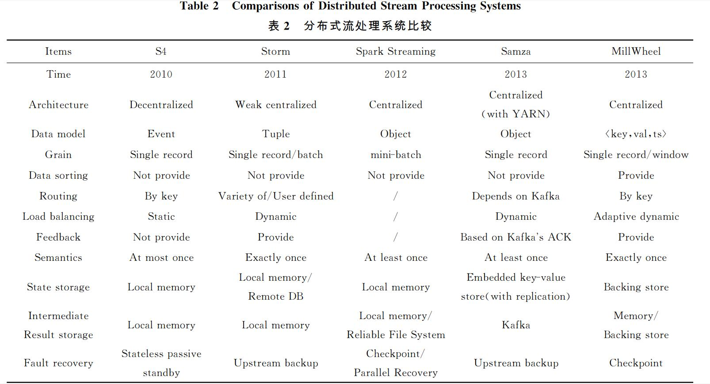

# 流处理模型报告 #
#
## 流处理模型与ELT特性对比 ##
### ETL：
### 1. 静态数据与批处理架构，充裕时间处理静态数据，实时性要求不高。
### 流处理模型：
### １. 数据规模庞大，往往达到ＰＢ级别；数据产生速度极快，可以达到 ＧＢ／ｓ级别；
### ２. 处理过程往往会涉及到复杂的数学模型，需要提供强力的底层支持，以保证这些模型在海量、高速数据环境中可以高效工作；
### ３. 数据的时效性很强，导致对数据处理过程的整体延迟要求非常苛刻，必须在秒级或更短的时间内得到结果，从而进一步作出反应．
	
### 优点:更关注实时性，响应时间短
### 缺点:吞吐量较差
## 比较主流流处理框架 ##
### Apache Storm
#### Storm是大规模流处理中的先行者并且逐渐成为了行业标准。Storm是一个典型的Native Streaming系统并且提供了大量底层的操作接口。另外，Storm使用了Thrift来进行拓扑的定义，并且提供了大量其他语言的接口。

### Trident
#### Trident 是一个基于Storm构建的上层的Micro-Batching系统，它简化了Storm的拓扑构建过程并且提供了类似于窗口、聚合以及状态管理等等没有被Storm原生支持的功能。另外，Storm是实现了至多一次的投递原则，而Trident实现了恰巧一次的投递原则。Trident 提供了 Java, Clojure 以及 Scala 接口。

### Spark
#### Spark是一个非常流行的提供了类似于SparkSQL、Mlib这样内建的批处理框架的库，并且它也提供了 Spark Streaming这样优秀地流处理框架。Spark的运行环境提供了批处理功能，因此，Spark Streaming毫无疑问是实现了Micro-Batching机制。输入的数据流会被接收者分割创建为Micro-Batches，然后像其他 Spark任务一样进行处理。Spark 提供了 Java, Python 以及 Scala 接口。

### Samza
#### Samza最早是由LinkedIn提出的与Kafka协同工作的优秀地流解决方案，Samza已经是LinkedIn内部关键的基础设施之一。Samza重负依赖于Kafaka的基于日志的机制，二者结合地非常好。Samza提供了Compositional接口，并且也支持Scala。

## 评价
### 流处理模式是面向动态数据的细粒度处理模式，这种模式的处理延迟最低，适合用于监控系统、在线金融分析、算法交易等对实时性要求较高的应用场景。此模式在面向动态数据的实时处理领域有着不可替代的地位。

## 参考资料
### 分布式流处理技术综述 崔星灿 禹晓辉 刘 洋 吕朝阳 （山东大学计算机科学与技术学院 济南 250101）