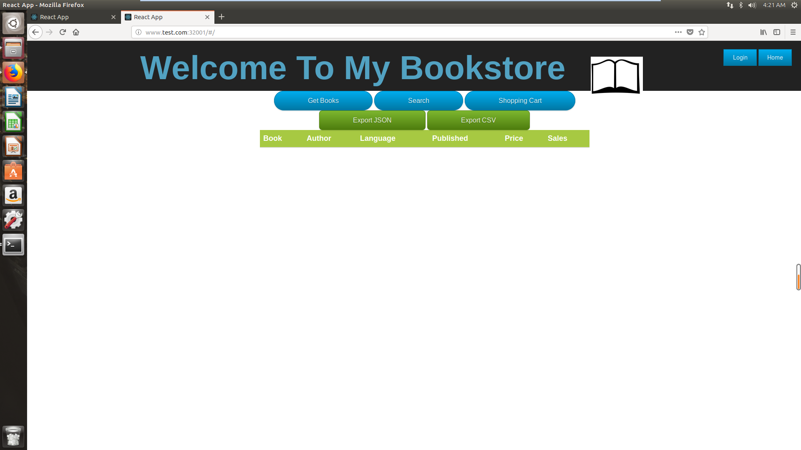
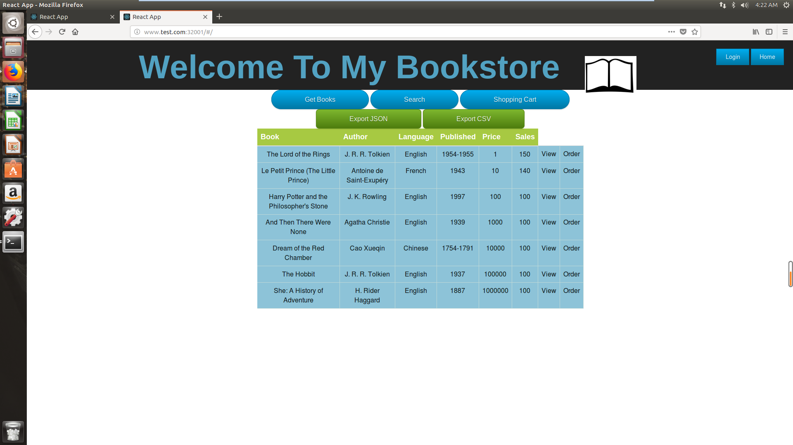
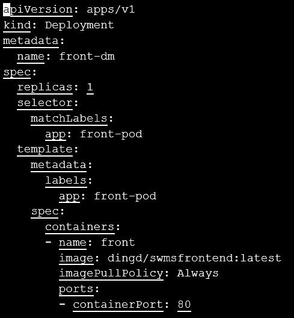
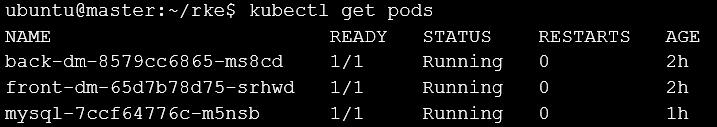
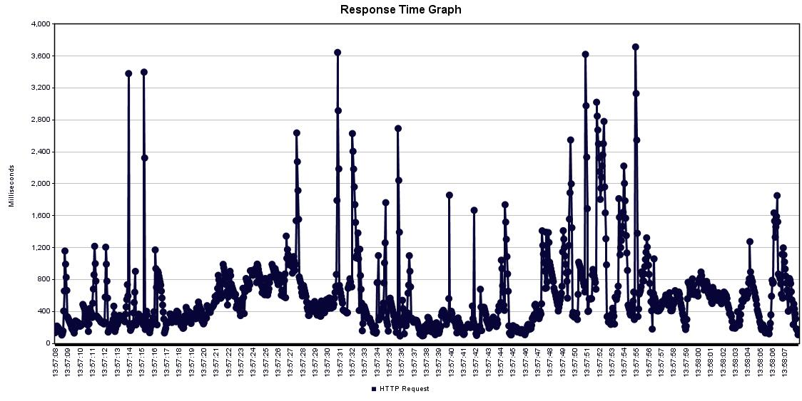
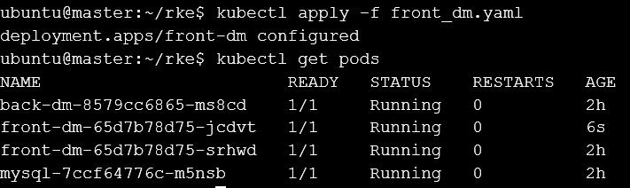
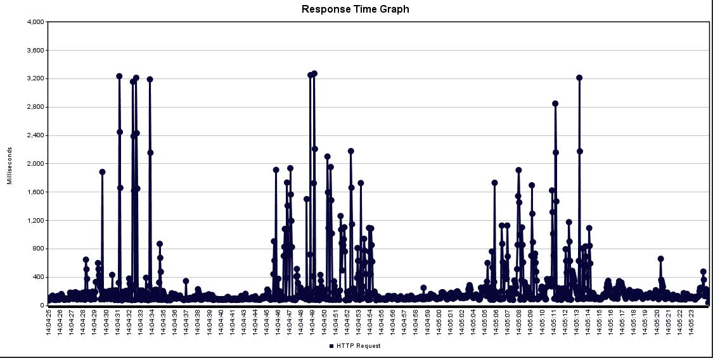
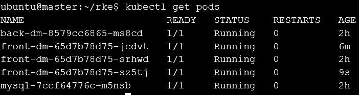
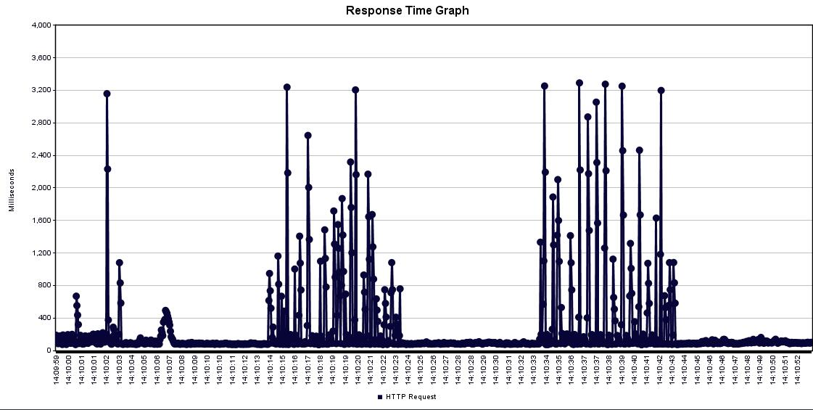

# Requirement 1
### prepare a CI/CD environment
### Prepare a web app, build contain image
### Automatically build images after a PR
* [前端](https://github.com/FJJLeon/k8s-bookstore-front)
* [后端](https://github.com/FJJLeon/k8s-bookstore)

## 搭建步骤
1. 使用**Travis.CI**搭建CI/CD，关于github与其账户的连接并使得Travis.CI监控目标项目的代码变更过程可以看之前的[Github项目](https://github.com/FJJLeon/wordladderCICD)
2. 这次的项目是一个web app，需要使用 MySQL 作为数据库，需要在配置文件 **.travis.yml** 中设置mysql服务。还新建了config/database.yml,作用未知
```
services:
  - mysql
```
3. CICD平台启动 **mvn test** 测试时会连接mysql数据库，需要**设置root密码**与JDBC一致，并作hibernate映射，需要在数据库中有相应的DATABASE和TABLE，因而要在配置文件中**运行mysql脚本**生成scheme并插入数据
```
before_install:
  - echo "USE mysql;\nUPDATE user SET password=PASSWORD('xxx') WHERE user='root';\nFLUSH PRIVILEGES;\n" | mysql -u root
  - mysql -u root --password="xxx" < sqlscript/all2.sql
  - sudo service mysql restart
```
4. 使用 **mvn install** 打包项目文件生成 war 包
5. 构建 **docker image** 需要使用 **Dockerfile** 如下，该文件指导docker build 指令如何从 tomcat 基础镜像开始构建新的镜像，主要是用 **ADD** 将war包加入到该镜像中
```
FROM tomcat:9-jre8
RUN apt-get update \
    && apt-get install -y --no-install-recommends cowsay \
    && rm -rf /var/lib/apt/lists/*
ENV PATH "$PATH:/usr/games"

ADD ./target/Mybk-iteration3-0.0.1-SNAPSHOT.war /usr/local/tomcat/webapps/

ENTRYPOINT ["cowsay"]
CMD ["Hello, World!"]
```
6. 自动化构建并发布image需要 [Docker Registry](https://docs.docker.com/registry/) ,在这里使用 [Docker Hub](https://hub.docker.com/), 在使用前需要注册账户，创建 repo ，创建 automation 等操作,完成后类似下图： 右侧的指令可以 push 新构建的 image 到这个镜像仓库
7. 构建运行发布新的docker image，注意tag的一致
```
before_script:
  - docker build --tag fjjleon/bookstore .
  - docker run fjjleon/bookstore

······

before_deploy:
  - docker login -u "$REGISTRY_USER" -p "$REGISTRY_PWD"

deploy:
  provider: script
  script: docker push fjjleon/bookstore
  on:
    branch: master
```
8. 完成配置后，有新的代码变更时Travis.CI就会自动进行CICD，构建image发布到Docker Hub上。
* PS: WEBAPP不是前后端分离的，配合k8s的部分会出现问题

9. 修改webapp项目使其前后端分离，使用了 **nginx** 运行前端静态页面，其中涉及了**跨域访问**的问题，~~这里配置了反向代理，由nginx服务器转发相应跨域访问请求。配置时注意会出现到端口号无法使用的情况，修改使用其他端口~~，nginx反向代理存在问题，改为直接由ajax访问后端api，配合后端加入了cors的配置。详细配置文件见[前端项目文件nginx.conf](https://github.com/FJJLeon/k8s-bookstore-front/blob/master/nginx.conf)

10. 类似后端项目的CICD配置过程，为前端项目添加CICD，其中项目打包脚本，Dockerfile需要作相应修改，使用 **npm** 打包项目，基础镜像使用 **nginx**，新建了docker hub仓库储存前端镜像。

11. 暂时使用的mysql是Host的 mysql 服务，在mysql上安装MySQL服务,中间为root设置密码为 fangjj1998，否则可能jdbc还是无法访问。另外需要运行sql脚本导入数据
```
sudo apt-get update
sudo apt-get install mysql-server
可以执行 mysql_secure_installation 第一个 y， 后面全部回车
systemctl status mysql.service
mysql -u root --password "fangjj1998" < all2.sql
```
12. 在docker pull 之后要 docker run 时使用，使用了HOST的网段，做法不是很好，需要改进，或者加 (-d)以守护进程运行
```
sudo docker run -p 8200:8080 -p 3306:3306  --network="host" fjjleon/bookstore
```
13. 在浏览器访问 http://localhost:8080/Mybk-iteration3/#/ 可以渲染出界面，但是点击 Get Books 在 Console 控制台看到了数据，但是没有渲染，考虑是浏览器问题

14. 不使用nginx的反向代理，跨域访问需要在后端里加入 **cors** 的 [config](https://github.com/FJJLeon/k8s-bookstore/blob/master/src/main/java/mybk3/config/CorsConfig.java)

15. 使用 Tomcat 运行 war 包以部署时，无论是访问静态网页还是访问api都要加上 war 包名，形如 [ip]:[port]/[war包名(不包括.war)]/[api]

16. 数据库配置完成后在mysql的shell 可以直接手动复制粘贴初始化数据，注意账户与后端JDBC一致
## Reference
* [TravisCI: Setup MySQL Tables+Data before running Tests](https://andidittrich.de/2017/06/travisci-setup-mysql-tablesdata-before-running-tests.html)
* [Setting up Databases Travis.CI docs](https://docs.travis-ci.com/user/database-setup/#mysql)
* [Change MySQL password in Travis-CI](https://coderwall.com/p/nyth7g/change-mysql-password-in-travis-ci)
* [dockerfile 介绍](https://www.cnblogs.com/boshen-hzb/p/6400272.html)
* [Coding Tips: Patterns for Continuous Integration with Docker on Travis CI](https://medium.com/mobileforgood/coding-tips-patterns-for-continuous-integration-with-docker-on-travis-ci-9cedb8348a62)
* [用nginx的反向代理机制解决前端跨域问题](https://www.cnblogs.com/gabrielchen/p/5066120.html)
* [From inside of a Docker container, how do I connect to the localhost of the machine?](https://stackoverflow.com/questions/24319662/from-inside-of-a-docker-container-how-do-i-connect-to-the-localhost-of-the-mach)
* [Deploy a Spring Boot WAR into a Tomcat Server](https://www.baeldung.com/spring-boot-war-tomcat-deploy)
* [How-can-I-run-SQL-file-in-Ubuntu](https://www.quora.com/How-can-I-run-SQL-file-in-Ubuntu)
* [SpringBoot配置Cors解决跨域请求问题](https://www.cnblogs.com/yuansc/p/9076604.html)

# Requirement 2

## 使用RancherLabs提供的工具RKE(Rancher Kubernetes Engine)可快速部署Kubernetes集群
### 使用ubuntu无需调许多系统设置，要禁用swap，启用Cgroup等。
### DNS 只要在部署配置文件时，在addons中部署路由器规则即可。
### Dashboard 同样只需配置好官网的yaml文件即可。

# Requirement 3
## 在腾讯云服务器创建集群  
* 服务器环境：  
  * master节点：Ubuntu 16.04.1 LTS (GNU/Linux 2核 4G内存)  
  * node节点：Ubuntu 16.04.1 LTS (GNU/Linux 1核 1G内存)

* 安装指定版本的docker：  
      https://releases.rancher.com/install-docker/17.03.sh  
      卸载掉之前版本的docker后运行该脚本即可安装17.03版本的docker
* 配置ssh  
  ssh-keygen生成密匙，在/etc/hosts目录下加入其他节点的内网IP（因为腾讯云的主机同一个地区同一个用户是有内网连接的路由规则的）  
  在ssh-copy-id [hostname]将公匙发送给相应主机，此时就能免密ssh连接，即满足rke的需求
* 配置rke config  
  rke的cluster.yml是一个高度集成的配置文件，通过./rke up --config [config-file]即可一键部署。config参数默认为同目录下的cluster.yml,可以手动设置。如果最后一行是 Finished building Kubernetes cluster successfully 代表集群创建成功。
  ```
  //cluster.yml
  nodes:
  - address: 172.17.16.6
    user: ubuntu
    role: [controlplane,etcd,worker]
    ssh_key_path: ~/.ssh/id_rsa
  - address: 172.17.0.12
    user: cse
    role: [worker]
    ssh_key_path: ~/.ssh/id_rsa
  network:
  plugin: flannel
  system_images:
    flannel: rancher/coreos-flannel:v0.9.1
  ```  
  创建成功后运行
  ```
  cp kube_config_cluster.yml ${HOME}/.kube/config
  chmod 777 ${HOME}/.kube/config
  ```
  这是将新生成的集群配置文件放入正确的位置，让知乎kubectl的使用免参数
* 安装kubctl  
  在官方提供的URL里下载即可：  
  https://github.com/kubernetes/kubernetes/blob/master/CHANGELOG.md#client-binaries-1   
  下载完成后，运行以下shell命令：
  ```
  tar -zxvf kubernetes-client-linux-amd64.tar.gz
  sudo mv /kubernetes/client/bin/kubectl /usr/local/bin/kubectl
  ```     
    此时就安装成功，使用方法如下：
    ```
    kubectl version
    kubectl get nodes//查看节点信息
    kubectl get pods,svc//查看pods与service情况
    kubectl apply -f [yaml-file]//部署应用
    ```

## 在kubernetes集群上部署应用
  

## 数据库部署：  
使用deployment部署MySQL的pod，并对外暴露32000端口  
```
IN MASTER:
kubectl apply -f mysql-dm.yaml
kubectl apply -f mysql-svc.yaml

IN YOUR OWN COMPUTER: 
mysql -h[Master's public Ip] -P32000 -uroot -p[Mysql Password]

mysql> 

```
然后进入MySQL命令行模式，输入sql脚本。

## 前端部署：
使用deployment对它进行部署，对外暴露32001端口。
```
IN MASTER:
kubectl apply -f front-dm.yaml
kubectl apply -f front-svc.yaml
```
## 后端部署：
同样使用deployment进行部署,对外暴露32002端口  
进行ingress配置，即将www.test.com时将流量转发给service，同时在自己的主机上 /etc/hosts文件里增加hosts->public IP的映射
```
IN MASTER:
kubectl apply -f back-ingress.yaml
kubectl apply -f back-dm-yaml
kubectl apply -f back-svc.yaml
```
## Demo:


then cleck button "Get Books"  


于是现在实现了“deploy your web application on kubernetes”


# Requirement 4
# Load Balance
## measure the reponse time of different scale
# 初始状态：replica = 1


### get pods得到frontend1个pod
### 此时使用jmeter加压，使用response time graph查看RPS增长情况 jmeter安装配置略
### 20s逐渐启动20个线程，循环访问test:32001端口获取前端，执行60s。
### 得到其增长曲线如下

# 修改yaml文件后执行kubectl apply -f front_dm.yaml 
# replica=2重复以上步骤

## 结果如下

## 考虑网络波动和其他原因，我们关注曲线下方较平滑的位置，可见其平均RPS处于100ms左右，2pods明显低于1pod时的RPS。
# replica=3重复以上步骤

## 结果如下

## 可见3pods时平均RPS略微低于2pods时的RPS，且更加平滑。

## 故两个实例可以满足峰值情况下正常平均RPS不高于500ms。