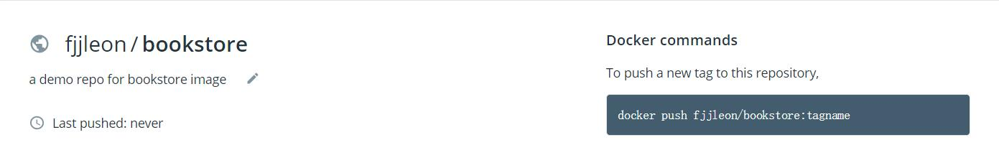

# Requirement 1
### prepare a CI/CD environment
### Prepare a web app, build contain image
### Automatically build images after a PR
* [前端](https://github.com/FJJLeon/k8s-bookstore-front)
* [后端](https://github.com/FJJLeon/k8s-bookstore)

## 搭建步骤
1. 使用**Travis.CI**搭建CI/CD，关于github与其账户的连接并使得Travis.CI监控目标项目的代码变更过程可以看之前的[Github项目](https://github.com/FJJLeon/wordladderCICD)
2. 这次的项目是一个web app，需要使用 MySQL 作为数据库，需要在配置文件 **.travis.yml** 中设置mysql服务。还新建了config/database.yml,作用未知
```
services:
  - mysql
```
3. CICD平台启动 **mvn test** 测试时会连接mysql数据库，需要**设置root密码**与JDBC一致，并作hibernate映射，需要在数据库中有相应的DATABASE和TABLE，因而要在配置文件中**运行mysql脚本**生成scheme并插入数据
```
before_install:
  - echo "USE mysql;\nUPDATE user SET password=PASSWORD('xxx') WHERE user='root';\nFLUSH PRIVILEGES;\n" | mysql -u root
  - mysql -u root --password="xxx" < sqlscript/all2.sql
  - sudo service mysql restart
```
4. 使用 **mvn install** 打包项目文件生成 war 包
5. 构建 **docker image** 需要使用 **Dockerfile** 如下，该文件指导docker build 指令如何从 tomcat 基础镜像开始构建新的镜像，主要是用 **ADD** 将war包加入到该镜像中
```
FROM tomcat:9-jre8
RUN apt-get update \
    && apt-get install -y --no-install-recommends cowsay \
    && rm -rf /var/lib/apt/lists/*
ENV PATH "$PATH:/usr/games"

ADD ./target/Mybk-iteration3-0.0.1-SNAPSHOT.war /usr/local/tomcat/webapps/

ENTRYPOINT ["cowsay"]
CMD ["Hello, World!"]
```
6. 自动化构建并发布image需要 [Docker Registry](https://docs.docker.com/registry/) ,在这里使用 [Docker Hub](https://hub.docker.com/), 在使用前需要注册账户，创建 repo ，创建 automation 等操作,完成后类似下图： 右侧的指令可以 push 新构建的 image 到这个镜像仓库
7. 构建运行发布新的docker image，注意tag的一致
```
before_script:
  - docker build --tag fjjleon/bookstore .
  - docker run fjjleon/bookstore

······

before_deploy:
  - docker login -u "$REGISTRY_USER" -p "$REGISTRY_PWD"

deploy:
  provider: script
  script: docker push fjjleon/bookstore
  on:
    branch: master
```
8. 完成配置后，有新的代码变更时Travis.CI就会自动进行CICD，构建image发布到Docker Hub上。
* PS: WEBAPP不是前后端分离的，配合k8s的部分会出现问题

9. 修改webapp项目使其前后端分离，使用了 **nginx** 运行前端静态页面，其中涉及了**跨域访问**的问题，这里配置了反向代理，由nginx服务器转发相应跨域访问请求。配置时注意会出现到端口号无法使用的情况，修改使用其他端口。详细配置文件见[前端项目文件nginx.conf](https://github.com/FJJLeon/k8s-bookstore-front/blob/master/nginx.conf)

10. 类似后端项目的CICD配置过程，为前端项目添加CICD，其中项目打包脚本，Dockerfile需要作相应修改，使用 **npm** 打包项目，基础镜像使用 **nginx**，新建了docker hub仓库储存前端镜像。

11. 暂时使用的mysql是Host的 mysql 服务，在mysql上安装MySQL服务,中间为root设置密码为 fangjj1998，否则可能jdbc还是无法访问。另外需要运行sql脚本导入数据
```
sudo apt-get update
sudo apt-get install mysql-server
可以执行 mysql_secure_installation 第一个 y， 后面全部回车
systemctl status mysql.service
mysql -u root --password "fangjj1998" < all2.sql
```
12. 在docker pull 之后要 docker run 时使用，使用了HOST的网段，做法不是很好，需要改进，或者加 (-d)以守护进程运行
```
sudo docker run -p 8200:8080 -p 3306:3306  --network="host" fjjleon/bookstore
```
13. 在浏览器访问 http://localhost:8080/Mybk-iteration3/#/ 可以渲染出界面，但是点击 Get Books 在 Console 控制台看到了数据，但是没有渲染，考虑肯恶搞是浏览器问题
## Reference
* [TravisCI: Setup MySQL Tables+Data before running Tests](https://andidittrich.de/2017/06/travisci-setup-mysql-tablesdata-before-running-tests.html)
* [Setting up Databases Travis.CI docs](https://docs.travis-ci.com/user/database-setup/#mysql)
* [Change MySQL password in Travis-CI](https://coderwall.com/p/nyth7g/change-mysql-password-in-travis-ci)
* [dockerfile 介绍](https://www.cnblogs.com/boshen-hzb/p/6400272.html)
* [Coding Tips: Patterns for Continuous Integration with Docker on Travis CI](https://medium.com/mobileforgood/coding-tips-patterns-for-continuous-integration-with-docker-on-travis-ci-9cedb8348a62)
* [用nginx的反向代理机制解决前端跨域问题](https://www.cnblogs.com/gabrielchen/p/5066120.html)


# Requirement 2

## 使用RancherLabs提供的工具RKE(Rancher Kubernetes Engine)可快速部署Kubernetes集群
### 使用ubuntu无需调许多系统设置，要禁用swap，启用Cgroup等。
### DNS 只要在部署配置文件时，在addons中部署路由器规则即可。
### Dashboard 同样只需配置好官网的yaml文件即可。

